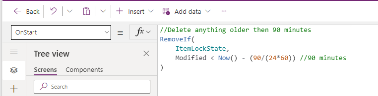
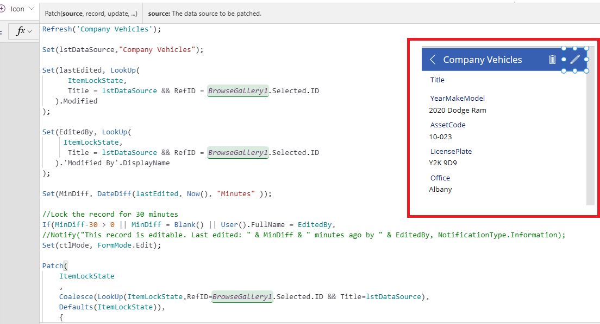
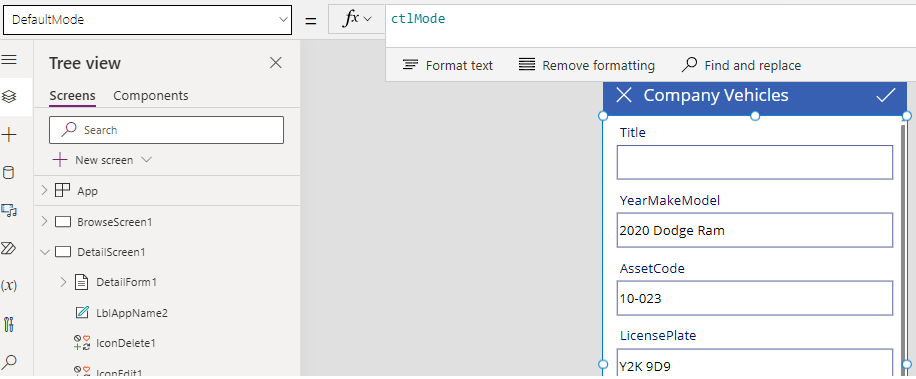

# Prevent multiple users from editing same records

## List Name: ItemLockState

The following columns are required.

| Column Name          | Column Type          |
|----------------------|----------------------|
| Title                | Single line of text  |
| RefID                | Number               |
| Increment            | Number               |
| Modified             | Date and Time        |
| Created              | Date and Time        |
| Created By           | Person or Group      |
| Modified By          | Person or Group      |

## Formula: OnStart

```
//Delete anything older then 90 minutes
RemoveIf(
    ItemLockState,
    Modified < Now() - (90/(24*60)) //90 minutes
)
```        


## Formula: OnSelect

```
Refresh('Your data source');

Set(lstDataSource,"Your data source");

Set(lastEdited, LookUp(
      ItemLockState,
      Title = lstDataSource && RefID = BrowseGallery1.Selected.ID
   ).Modified
);

Set(EditedBy, LookUp(
     ItemLockState,
      Title = lstDataSource && RefID = BrowseGallery1.Selected.ID
   ).'Modified By'.DisplayName
);

Set(MinDiff, DateDiff(lastEdited, Now(), "Minutes" ));

//Lock the record for 30 minutes
If(MinDiff-30 > 0 || MinDiff = Blank() || User().FullName = EditedBy,
//Notify("This record is editable. Last edited: " & MinDiff & " minutes ago by " & EditedBy, NotificationType.Information);
Set(ctlMode, FormMode.Edit);

Patch(
    ItemLockState
    ,
    Coalesce(LookUp(ItemLockState,RefID=BrowseGallery1.Selected.ID && Title=lstDataSource),
    Defaults(ItemLockState)),
    {
        RefID: BrowseGallery1.Selected.ID,
        Title: lstDataSource,
        Increment: LookUp(ItemLockState,RefID=BrowseGallery1.Selected.ID && Title=lstDataSource).Increment + 1
    }
)
,
Notify("This Record is locked by user " & EditedBy & ", " & MinDiff & " minutes ago", NotificationType.Warning);
Set(ctlMode, FormMode.View);
);

//EditForm(EditForm1);
Navigate(EditScreen1, ScreenTransition.None)
```



## Formula: DefaultMode

```
ctlMode
```




| Version | Date | Author|
|-----|-----|-----|
|1.0|01 Jul 2023 | MR |

## Disclaimer

THIS CODE IS PROVIDED AS IS WITHOUT WARRANTY OF ANY KIND, EITHER EXPRESS OR IMPLIED, INCLUDING ANY IMPLIED WARRANTIES OF FITNESS FOR A PARTICULAR PURPOSE, MERCHANTABILITY, OR NON-INFRINGEMENT.
